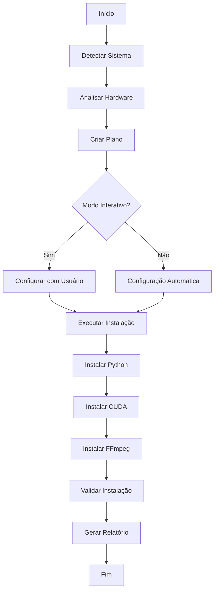

# 🚀 VideoConverter - Instalador Universal Inteligente

Instalador automático que configura todo o ambiente necessário para o VideoConverter, incluindo Python 3.13, NVIDIA GPU/CUDA (se compatível), FFmpeg/FFprobe e todas as dependências.

## ✨ Características

### 🎯 **Instalação Inteligente**
- **Detecção automática** do sistema operacional e hardware
- **Análise de compatibilidade** antes da instalação
- **Instalação seletiva** apenas do que é necessário
- **Validação em 3 níveis** (básica, avançada, benchmark)

### 🖥️ **Suporte Multi-Plataforma**
- ✅ **Windows** 10/11 (x64/x86)
- ✅ **Linux** (Ubuntu, Debian, CentOS, Fedora, Arch)
- ✅ **macOS** (Intel/Apple Silicon)

### 🔧 **Componentes Gerenciados**--
- 🐍 **Python 3.13** - Instalação e configuração automática
- 🚀 **NVIDIA CUDA** - Detecção de GPU e instalação compatível
- 🎬 **FFmpeg/FFprobe** - Download e configuração de PATH
- 📦 **Dependências** - Instalação automática de bibliotecas

### 🎨 **Interface Avançada**
- 📊 **Progress bars** animadas e informativas
- 🎨 **Output colorido** com diferentes níveis
- 📝 **Logging detalhado** com rotação de arquivos
- ⚡ **Modo interativo** ou automático

### 🔒 **Recursos Avançados**
- 💾 **Cache inteligente** para downloads
- 🔄 **Modo offline** com cache local
- 🛡️ **Verificação de integridade** de arquivos
- 🔧 **Configuração customizada** via JSON
- 📊 **Relatórios detalhados** de instalação

## 🚀 Início Rápido

### 1. **Pré-requisitos**
```bash
# Python 3.8+ (para executar o instalador)
python --version

# Privilégios administrativos (Windows/Linux)
# O instalador solicitará elevação automaticamente
```

### 2. **Download e Preparação**
```bash
# Clone o repositório
git clone https://github.com/seu-usuario/videoconverter.git
cd videoconverter/installer

# Instalar dependências do instalador
pip install -r requirements.txt
```

### 3. **Execução Básica**
```bash
# Modo interativo (recomendado)
python main_installer.py

# Modo automático
python main_installer.py --auto

# Apenas validar instalação existente
python main_installer.py --validate-only
```

## 📋 Modos de Uso

### 🎯 **Modo Interativo**
```bash
python main_installer.py
```
- Interface guiada passo a passo
- Escolha personalizada de componentes
- Configuração de opções avançadas
- Recomendado para primeira instalação

### ⚡ **Modo Automático**
```bash
python main_installer.py --auto
```
- Instalação completamente automática
- Detecta e instala apenas o necessário
- Ideal para scripts e CI/CD
- Usa configurações padrão otimizadas

### 🔧 **Modo Customizado**
```bash
python main_installer.py --config config.json
```
- Usa arquivo de configuração personalizada
- Controle total sobre instalação
- Ideal para ambientes corporativos

### 💾 **Modo Offline**
```bash
python main_installer.py --offline
```
- Usa apenas cache local
- Não faz downloads da internet
- Requer cache previamente populado

## ⚙️ Configuração Avançada

### 📄 **Arquivo de Configuração**
Crie um arquivo `config.json` para personalizar a instalação:

```json
{
  "python": {
    "default_version": "3.13.0",
    "install_path_windows": "C:\\Python313"
  },
  "cuda": {
    "supported_versions": ["12.6.0", "12.5.1", "12.4.1"]
  },
  "ffmpeg": {
    "install_path_windows": "C:\\ffmpeg"
  },
  "validation": {
    "timeout_seconds": 60,
    "benchmark_duration": 30
  },
  "network": {
    "timeout_seconds": 30,
    "retry_attempts": 3
  },
  "cache_enabled": true,
  "offline_mode": false,
  "require_admin": true
}
```

### 🎨 **Opções de Linha de Comando**
```bash
# Configuração básica
python main_installer.py [opções]

# Opções disponíveis:
--auto                    # Modo automático
--config CONFIG.json      # Arquivo de configuração
--cache-dir DIRETORIO     # Diretório de cache personalizado
--offline                 # Modo offline
--validate-only           # Apenas validar
--report ARQUIVO.txt      # Salvar relatório
--verbose                 # Log detalhado

# Exemplos:
python main_installer.py --auto --verbose
python main_installer.py --config empresa.json --report relatorio.txt
python main_installer.py --offline --cache-dir /tmp/cache
```

## 🔍 Validação e Testes

### 📊 **Níveis de Validação**

#### 1. **Básica** - Verificação de Arquivos
- ✅ Executáveis existem no PATH
- ✅ Arquivos de configuração presentes
- ✅ Permissões adequadas

#### 2. **Avançada** - Testes Funcionais
- ✅ Versões corretas instaladas
- ✅ Funcionalidades básicas operacionais
- ✅ Integração entre componentes

#### 3. **Benchmark** - Testes de Performance
- ✅ Performance Python adequada
- ✅ CUDA funcionando corretamente
- ✅ FFmpeg processando vídeos

### 🧪 **Executar Apenas Validação**
```bash
# Validação completa
python main_installer.py --validate-only

# Validação com relatório
python main_installer.py --validate-only --report validacao.txt
```

## 📊 Relatórios e Logs

### 📄 **Relatório de Instalação**
```
🎯 RELATÓRIO DE INSTALAÇÃO - VIDEOCONVERTER
============================================================

📋 SISTEMA:
   OS: Windows 11 22H2
   Arquitetura: x64

📊 STATUS GERAL: ✅ SUCESSO
   Tempo de instalação: 245.3s

✅ COMPONENTES INSTALADOS:
   • Python 3.13.0
   • CUDA 12.6.0
   • FFmpeg 6.1.1

🔍 VALIDAÇÃO:
   ✅ python_executable
   ✅ python_version
   ✅ cuda_compiler
   ✅ cuda_functionality
   ✅ ffmpeg_executable
   ✅ ffmpeg_functionality

💡 RECOMENDAÇÕES:
   • Reiniciar terminal para aplicar mudanças de PATH
   • Testar VideoConverter com arquivo de exemplo
```

### 📝 **Logs Detalhados**
```bash
# Logs são salvos automaticamente em:
logs/
├── installer.log          # Log principal
├── installer.log.1        # Backup anterior
├── python_manager.log     # Log específico Python
├── cuda_installer.log     # Log específico CUDA
└── ffmpeg_manager.log     # Log específico FFmpeg
```

## 🛠️ Troubleshooting

### ❌ **Problemas Comuns**

#### **1. Erro de Privilégios**
```
❌ Erro: Privilégios administrativos necessários
```
**Solução:**
- Windows: Execute como Administrador
- Linux/macOS: Use `sudo python main_installer.py`

#### **2. Falha no Download**
```
❌ Erro: Falha ao baixar Python 3.13.0
```
**Soluções:**
- Verificar conexão com internet
- Usar modo offline se cache disponível
- Configurar proxy se necessário

#### **3. CUDA Incompatível**
```
❌ Erro: GPU não suporta CUDA
```
**Explicação:**
- GPU NVIDIA não detectada
- Driver NVIDIA desatualizado
- GPU muito antiga (< Compute 3.5)

#### **4. FFmpeg PATH**
```
❌ Erro: FFmpeg não encontrado no PATH
```
**Soluções:**
- Reiniciar terminal/sistema
- Verificar variáveis de ambiente
- Instalação manual do PATH

### 🔧 **Comandos de Diagnóstico**
```bash
# Verificar sistema
python -c "from installer.core.os_detector import OSDetector; print(OSDetector().detect_os())"

# Verificar GPU
python -c "from installer.core.gpu_detector import GPUDetector; print(GPUDetector().detect_gpus())"

# Verificar Python
python -c "from installer.core.python_manager import PythonManager; print(PythonManager().detect_python_installations())"

# Limpar cache
rm -rf cache/  # Linux/macOS
rmdir /s cache  # Windows
```

### 📞 **Suporte Avançado**
```bash
# Gerar relatório de diagnóstico
python main_installer.py --validate-only --verbose --report diagnostico.txt

# Executar com debug máximo
python main_installer.py --verbose 2>&1 | tee debug.log

# Testar componentes individualmente
python -m installer.core.os_detector
python -m installer.core.gpu_detector
python -m installer.core.python_manager
```

## 🏗️ Arquitetura

### 📁 **Estrutura do Projeto**
```
installer/
├── main_installer.py       # Script principal
├── requirements.txt        # Dependências
├── README.md              # Esta documentação
├── config/
│   ├── __init__.py
│   └── settings.py        # Configurações centralizadas
├── core/                  # Componentes principais
│   ├── __init__.py
│   ├── os_detector.py     # Detecção de sistema
│   ├── python_manager.py  # Gerenciador Python
│   ├── gpu_detector.py    # Detecção GPU/CUDA
│   ├── cuda_installer.py  # Instalador CUDA
│   └── ffmpeg_manager.py  # Gerenciador FFmpeg
└── utils/                 # Utilitários
    ├── __init__.py
    ├── logger.py          # Sistema de logging
    ├── progress.py        # Barras de progresso
    └── downloader.py      # Sistema de downloads
```

### 🔄 **Fluxo de Instalação**


## 🤝 Contribuição

### 🔧 **Desenvolvimento**
```bash
# Setup ambiente de desenvolvimento
git clone https://github.com/seu-usuario/videoconverter.git
cd videoconverter/installer

# Instalar dependências de desenvolvimento
pip install -r requirements.txt
pip install -r requirements-dev.txt

# Executar testes
pytest tests/

# Verificar código
black installer/
flake8 installer/
mypy installer/
```

### 📝 **Adicionando Novos Componentes**
1. Criar módulo em `core/`
2. Implementar interface padrão
3. Adicionar configurações em `settings.py`
4. Integrar no `main_installer.py`
5. Adicionar testes
6. Atualizar documentação

## 📄 Licença

Este projeto está licenciado sob a MIT License - veja o arquivo [LICENSE](../LICENSE) para detalhes.

## 🙏 Agradecimentos

- **Python Software Foundation** - Python
- **NVIDIA Corporation** - CUDA Toolkit
- **FFmpeg Team** - FFmpeg/FFprobe
- **Comunidade Open Source** - Bibliotecas e ferramentas

---

**VideoConverter Installer** - Configuração inteligente e automática do ambiente de desenvolvimento 🚀